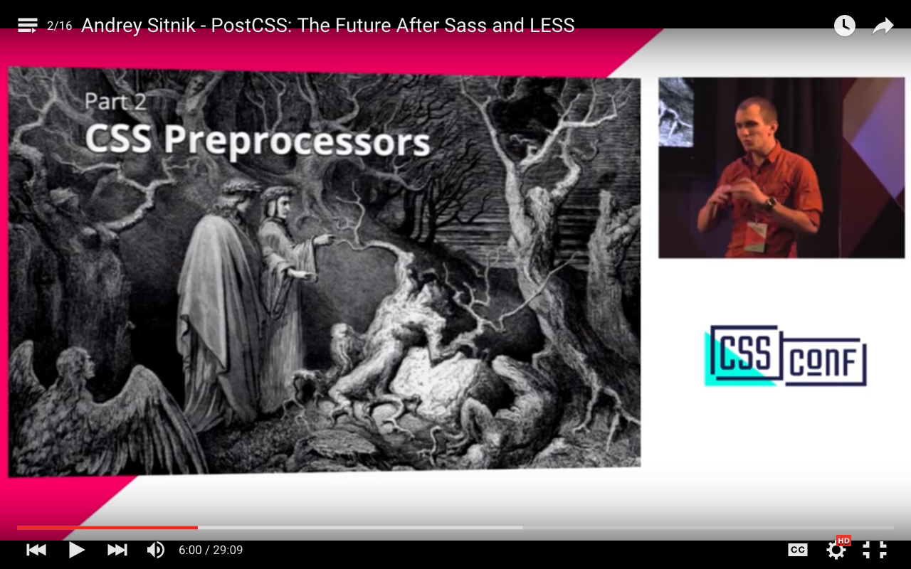
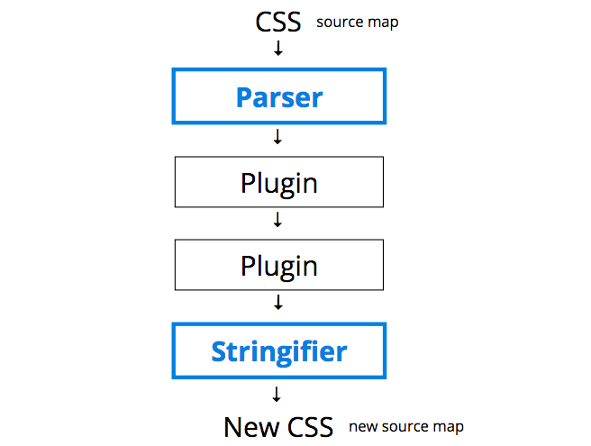

# sass-to-postcss
> Starter _(Grunt)_ project for new converts from [Sass](http://sass-lang.com/) to [PostCSS](https://github.com/postcss/postcss)

## Installation:
```
$ git clone git@github.com:cascadehnl/sass-to-postcss.git
$ cd sass-to-postcss
$ npm install
```

## Development
```
$ grunt serve
```

## Introduction to PostCSS
If you're reading this, then you probably already know how amazing preprocessors are: they provides tons of helpful stuff, essentially missing from CSS, like variables and mixins, and they help us write DRY, efficient code.

However, much like CSS itself, preprocessors are susceptible to stagnation, can be slow to evolve, and are incapable of growing at the speed of the community. 

Additionally, most preprocessors are written in programming languages like **C** which tend to be unfamiliar to the vast majority of the audiences they support.

[CSSConf 2015 - Andrey Sitnik - PostCSS: The Future After Sass and LESS](https://youtu.be/1yUFTrAxTzg?t=5m59s)

[](https://youtu.be/1yUFTrAxTzg?t=5m59s)

**And here in lies the problem Preprocessors (and CSS itself) that PostCSS aims to solve:** how do we take back control of our CSS authoring so we can continue to push boundaries and develop new features at our own speed?

PostCSS itself isn't a preprocessor _(or 'post'-processor)_; its just a simple node.js module that parses CSS and passes it to any number of plugins. The magic happens in those individual plugins.



This modular system of plugins which transforms your CSS _is the preprocessor._ See [project overview](#project-overview) for getting started with a new project using PostCSS. The project will include features and a coding syntax familiar to those from a Sass/SCSS background.

**Articles:**
- [What Will Save Us from the Dark Side of CSS Pre-Processors?](http://alistapart.com/column/what-will-save-us-from-the-dark-side-of-pre-processors)
- [Bootstrap v5 will likely be in PostCSS because holy crap that sounds cool.](https://twitter.com/mdo/status/591364406816079873)
- [Breaking up with Sass: it’s not you, it’s me](http://benfrain.com/breaking-up-with-sass-postcss/)
- [It's Time for Everyone to Learn About PostCSS](http://davidtheclark.com/its-time-for-everyone-to-learn-about-postcss/)
- [PostCSS Deep Dive: Roll Your Own Preprocessor](http://webdesign.tutsplus.com/tutorials/postcss-deep-dive-roll-your-own-preprocessor--cms-24584)

**Resources:**
- [PostCSS Benchmarks](https://github.com/postcss/benchmark#preprocessors)
- [PostCSS Deep Dive](http://webdesign.tutsplus.com/series/postcss-deep-dive--cms-889)

## Project Overview
This is a simple starter project using a custom CSS preprocessor based on PostCSS for those with a Sass/SCSS background. Project includes PostCSS via [Grunt PostCSS](https://github.com/nDmitry/grunt-postcss) and [PostCSS SCSS](https://github.com/postcss/postcss-scss) as necessary dependencies.

The project contains the following PostCSS transformers to create its preprocessor:
- **[PreCSS](https://jonathantneal.github.io/precss/)** - Sass-like markup
- **[Autoprefixer](https://github.com/postcss/autoprefixer)** - Add vendor prefixes to rules via Can I Use
- **[PostCSS Functions](https://github.com/andyjansson/postcss-functions)** - Expose JavaScript functions in CSS
- **[CSSNano](http://cssnano.co/)** - A *modular minifier/optimizer

_See [Gruntfile.js](Gruntfile.js) for transformer configurations and [package.json](package.json) for additional dependencies._